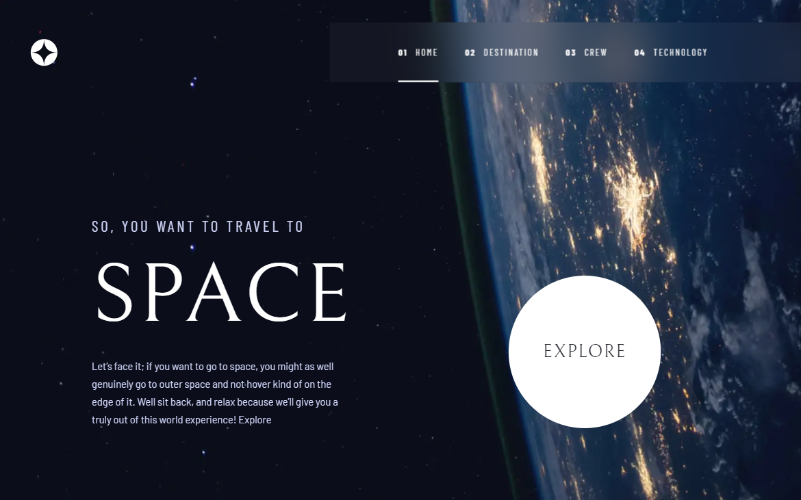
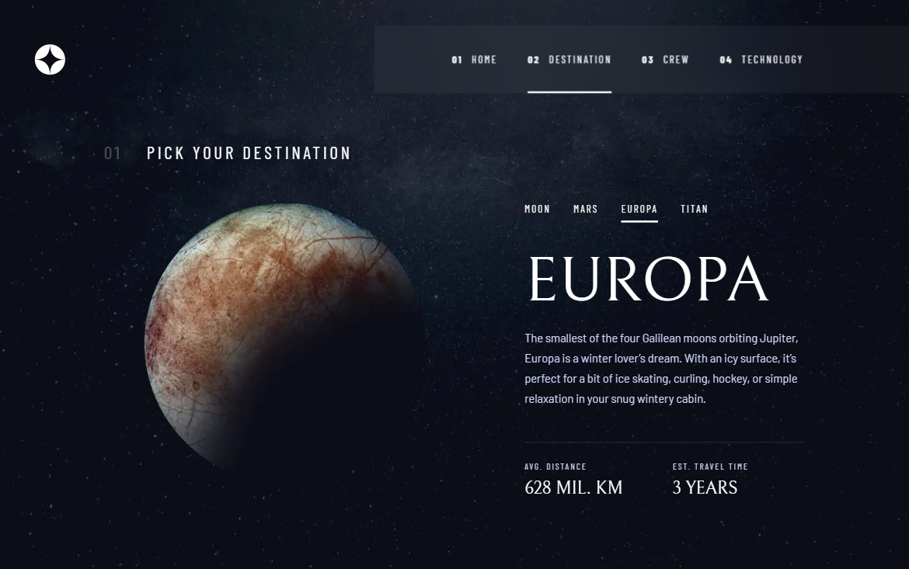
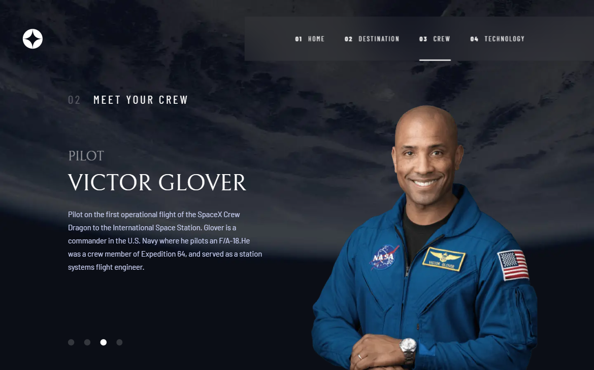
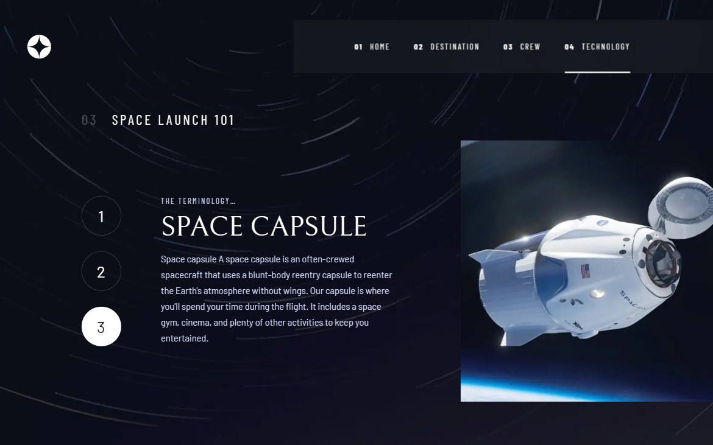

# Frontend Mentor - Space tourism website solution

This is a solution to the [Space tourism website challenge on Frontend Mentor](https://www.frontendmentor.io/challenges/space-tourism-multipage-website-gRWj1URZ3). Frontend Mentor challenges help you improve your coding skills by building realistic projects.

## Table of contents

- [Overview](#overview)
  - [The challenge](#the-challenge)
  - [Screenshots](#screenshots)
  - [Links](#links)
- [My process](#my-process)
  - [Built with](#built-with)
  - [What I learned](#what-i-learned)
- [Author](#author)

## Overview

### The challenge

Users should be able to:

- View the optimal layout for each of the website's pages depending on their device's screen size
- See hover states for all interactive elements on the page
- View each page and be able to toggle between the tabs to see new information

### Screenshots

### Links

- Solution URL: [https://github.com/firehawk89/space-tourism-website/tree/master](https://github.com/firehawk89/space-tourism-website/tree/master)
- Live Site URL: [https://firehawk89.github.io/space-tourism-website/](https://firehawk89.github.io/space-tourism-website/)

## My Process

### Built with

- HTML5
- SCSS preprocessor
- Flexbox
- JavaScript
- GULP

### What I learned

During this challenge I consolidated my knowledge of Flexbox and making responsive layouts. I also learned how to make [tabs](./src/js/tabs.js) and [bullets](./src/js/bullets.js). Surely, I implemented them on the [destination](./src/destination.html), [crew](./src/crew.html) and [technology](./src/technology.html) pages.

## Author

- Frontend Mentor - [@firehawk89](https://www.frontendmentor.io/profile/firehawk89)
- Telegram - [@Spokened](https://t.me/Spokened)
- LinkedIn - [Anton Bochkovskyi](https://www.linkedin.com/in/anton-bochkovskyi-4bb783250/)
